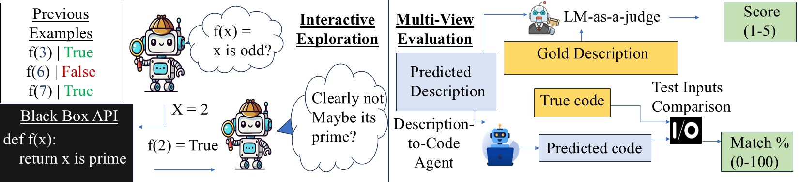

# PAU-Benchmark

Benchmark for evaluating LLMs on API discovery tasks in an **interactive** setting. Models must explore an API through targeted queries to learn its behavior before generating descriptions and code.




**Dataset:** Anonymized (but available on HuggingFace already)

---

## Prerequisites

- Python 3.12
- [`uv`](https://github.com/astral-sh/uv) (used to create virtual environments)
- A HuggingFace account with access to the dataset repo

---

## Setup

### 1. Clone with submodules

```bash
git clone --recursive <this_repo>
cd PAU-Benchmark
```

### 2. Fill in configuration

Edit [configs/private_vars.yaml](configs/private_vars.yaml) — all paths must be absolute:

```yaml
storage_dir: "/absolute/path/for/large/files"   # models, datasets
env_dir: "/absolute/path/to/envs"               # where virtual envs will live
```

Then generate the `config.env` file used by bash scripts:

```bash
python configs/create_env_file.py
```

### 3. Create virtual environments

```bash
bash runs/create.sh --env_dir /absolute/path/to/envs
```

This creates three isolated Python 3.12 environments:

| Environment | Purpose |
|---|---|
| `api_env/` | Main benchmark and API evaluation |
| `llm-utils_env/` | LLM inference utilities |
| `skyr_env/` | SkyRL training |

The script will prompt for confirmation before installing anything. If an environment already exists it will be skipped. If you only want to eval models on the benchmark, then you **only need the api_env**

**If a step fails:**
- *Python 3.12 not found* — install it or ensure `uv` can locate it
- *Symlink creation fails (Windows)* — enable Developer Mode or run the terminal as Administrator
- *Partial/corrupt environment* — delete the affected `*_env/` directory and re-run

### Manual environment setup (alternative)

If the script fails or you're on Windows, you can replicate each step manually. Replace `/path/to/envs` with your chosen directory throughout.

**1. Create and activate `api_env`** (the main benchmark environment):

```bash
uv venv /path/to/envs/api_env --python=3.12
ln -s /path/to/envs/api_env setup/.venv      # symlink used by utils.sh
source setup/.venv/bin/activate
cd setup && uv sync --active && cd ..
```

**2. Create `llm-utils_env`** (LLM inference utilities):

```bash
uv venv /path/to/envs/llm-utils_env --python=3.12
rm setup/.venv
ln -s /path/to/envs/llm-utils_env setup/.venv
source setup/.venv/bin/activate
cd setup && uv sync && cd ..
uv pip install transformers==4.57.5   # pins version to avoid SkyRL compatibility bugs
```

**3. Create `skyr_env`** (SkyRL training):

```bash
uv venv /path/to/envs/skyr_env --python=3.12
rm .venv
ln -s /path/to/envs/skyr_env .venv            # symlink from repo root
source .venv/bin/activate
uv sync
uv pip install transformers==4.57.5
```

After all three are created, restore the default symlink to `api_env` (used for benchmark runs):

```bash
rm setup/.venv
ln -s /path/to/envs/api_env setup/.venv
```

---

## Running the Benchmark

Activate the main environment, then run the interactive benchmark script:

```bash
source setup/.venv/bin/activate   # or the equivalent on Windows
bash scripts/benchmark_interactive.sh
```

This script runs three evaluation stages for each model:

1. **Interactive task** — model explores the API and generates descriptions (`baselines.py interactive`)
2. **Description eval** — scores the predicted descriptions (`eval.py description`)
3. **Code generation + eval** — model generates code, then scores it (`baselines.py code` → `eval.py code`)

Results are saved under `results/` with the naming convention `interactive_{model_name}`.

---

## Running Your Own Model

Edit [scripts/benchmark_interactive.sh](scripts/benchmark_interactive.sh) and add your model to the `model_names` list at the top of the file. The script already contains commented-out examples for GPT-4o, Qwen, Llama, and Granite.

If you want to run a model with an API service (e.g. OpenRouter) add a reference to it in the [model platforming routing line](utils/lm_inference.py#945).

---

## Analyzing Results

After benchmark runs complete, aggregate metrics across all models:

```bash
python see.py stats
```

This reads all results from `results/evals/`, computes per-task statistics, and saves:

- `results/figure_dfs/{task}_stats.jsonl` — aggregated metrics per task type
- `results/statistical_tests/` — pairwise significance tests (paired bootstrap, 10k samples)

**Optional filters:**

```bash
python see.py stats --kind description --model claude-opus-4
```

**Metrics reported:**

- *Description tasks* — average score ± std dev, score distributions (1–5), conclusion rates
- *Code tasks* — exact-match rate, partial-match rate (≥0.5), percentile breakdowns
